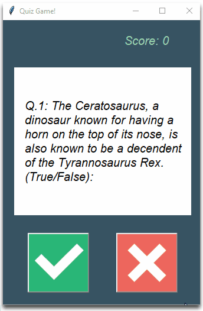

# Quiz App 🤔
From the open trivia database we will be creating a quiz app to answer fun questions 😆 regarding random subjects! 🤪

## Where are we getting the API from?🤔
The API is from the website ["Open Trivia Database"](https://opentdb.com/api_config.php) 
You can get tons of questions regarding a lot of subjects in there.

## What does the code does? 🤯
Is a Quiz App that is getting the data from the API and gives you 10 questions to answer.

## Concepts Applied 🧐:
- [x] API Management 🎨
  
- [x] Lists comprehension 🤓

- [x] Handling Errors

- [x] Object-Oriented Programming

- [x] User Interface

## Code Sneak Peek 😏

